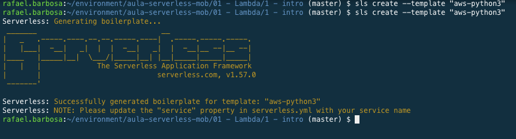
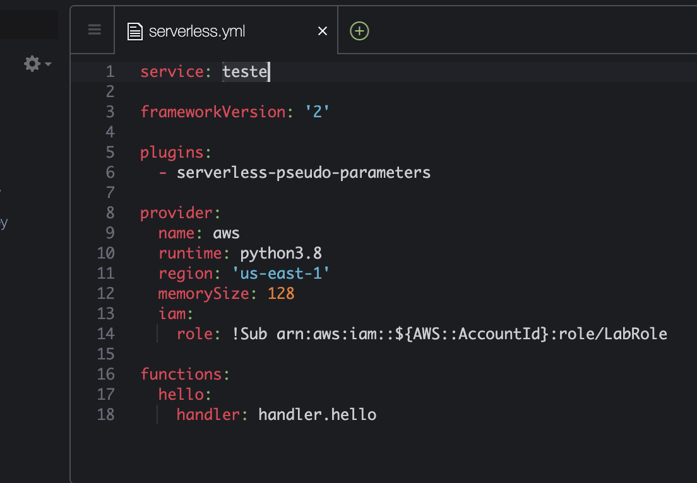
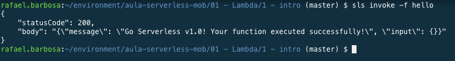
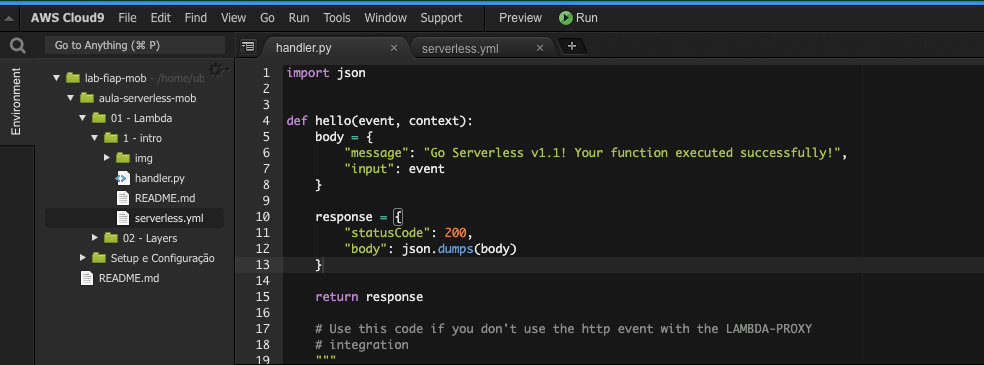
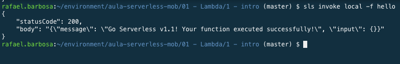
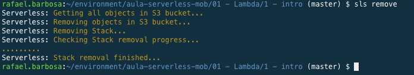

# Aula 01 - Lambda

1. No terminal do IDE criado no cloud9 execute o comando `cd ~/environment/hybridnativecloud-exercises-serverless/01\ -\ Lambda/01\ -\ intro/` para entrar na pasta que fara este exercicio.
 2. Iniciar o repositório de trabalho `sls create --template "aws-python3"`
 
 3. Execute o comando `npm install -g serverless-pseudo-parameters` para instalar o plugin necessário para essa stack.
 4. Explore os arquivos criados(serverless.yml e handler.py) pelo comando anterior utilizando o menu de navegação lateral:
    
 5. Abra o arquivo serverless.yml no IDE com o comando `c9 open serverless.yml`
 6. Altere o arquivo para que fique como na imagem abaixo. Para salvar utilize CTRL+S.
   
 7. No terminal do IDE faça deploy da função criada com o comando `sls deploy`
 
 5. Testar remotamente a função `sls invoke -f hello`

 6. Altere a versão do retorno da função para 1.1 no arquivo "handler.py" como na imagem e salve com as teclas "CTRL + S"
   
 7. Faça um teste local da sua função no terminal com o comando `sls invoke local -f hello` 

 8. Para deletar a função que esta no lambda utilize o comando `sls remove`

