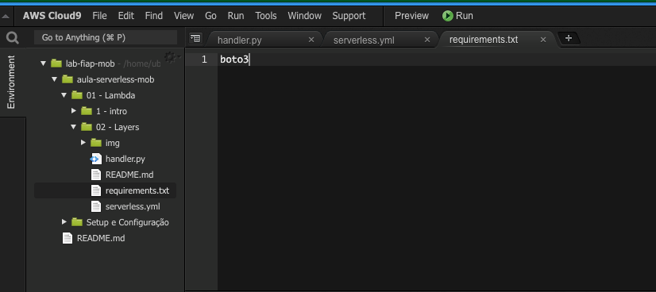
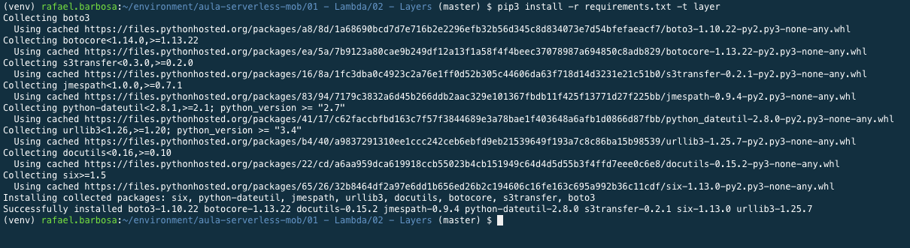
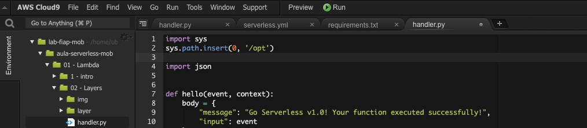
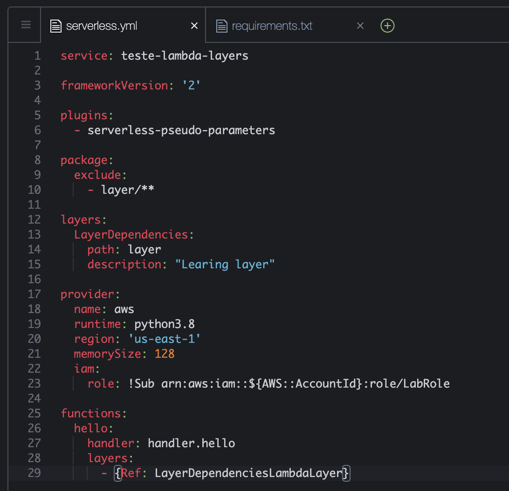
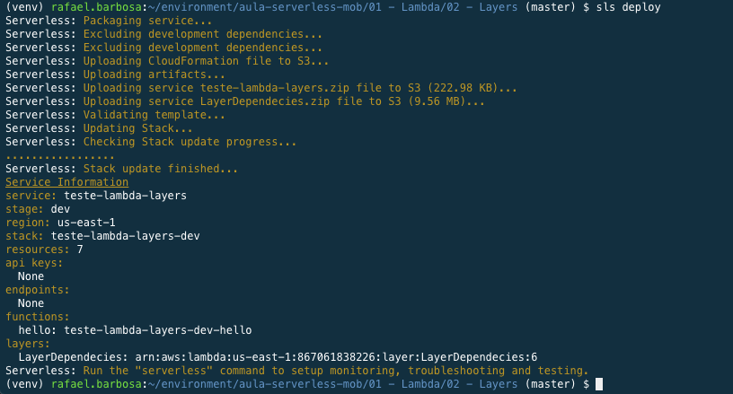
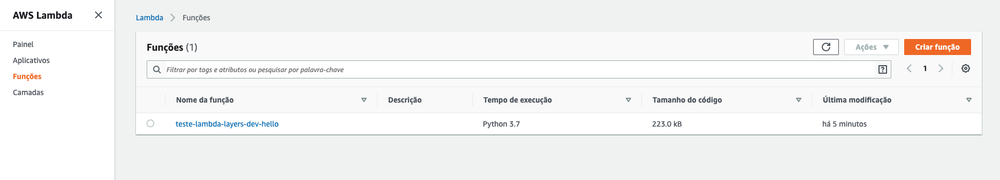
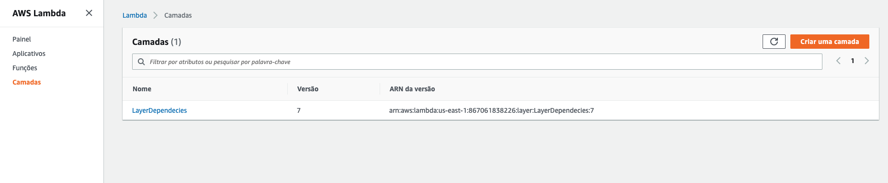
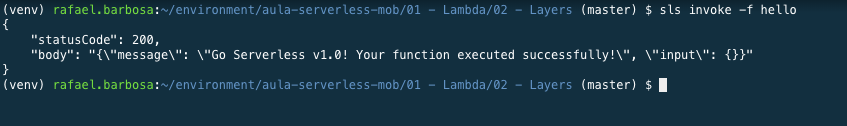

# Aula 01.2 - Lambda Layers

1. No terminal do IDE criado no cloud9 execute o comando `cd ~/environment/hybridnativecloud-exercises-serverless/01\ -\ Lambda/02\ -\ Layers/` para entrar na pasta que fara este exercicio.
   
2. Iniciar o repositório de trabalho `sls create --template "aws-python3"`.
  
    
3. Crie um arquivo chamado requirements.txt com o conteúdo 'boto3'.
       
      

4. Execute o comando no terminal `python3 -m venv ~/venv` para criar um ambiente virtual python e pode baixar as dependencias sem conflitar com nenhuma dependecia já baixada.
5. Execute o comando no terminal `source ~/venv/bin/activate` para ativar o ambiente virtual criado no passo anterior
6. Crie uma pasta chamada `layer` utilizando o comando no terminal `mkdir layer`.
7. Execute o comando `pip3 install -r requirements.txt -t layer` para instalar todas as dependencias listadas no arquivo requirements.txt dentro da pasta layer.
    
8. Altere o topo do arquivo handler.py para que fique como na imagem:
   
7. No serverless.yml deixe o arquivo como na imagem, podem apagar todo o conteudo existente: 
   
8. Fazer deploy da função criada `sls deploy`
    
9. Em uma outra aba do seu navegavor abra o console da AWS e vá para o serviço "Lambda".
    
11. Note a função que acabou de criar já esta no painel, para ver a layer clique em "camadas" no menu lateral da página
    
    
12. Para remotamente a função utilize o comando `sls invoke -f hello` no terminal
  
10. destrua a função feita `sls remove`