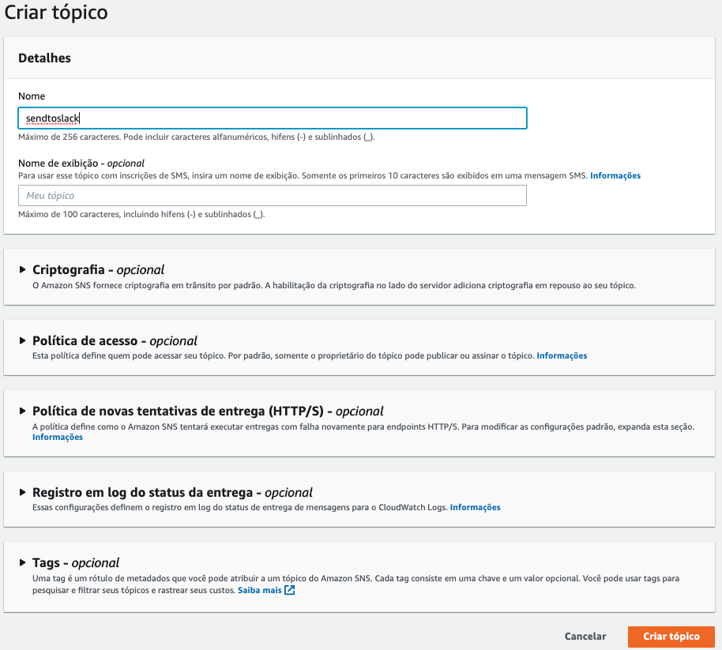
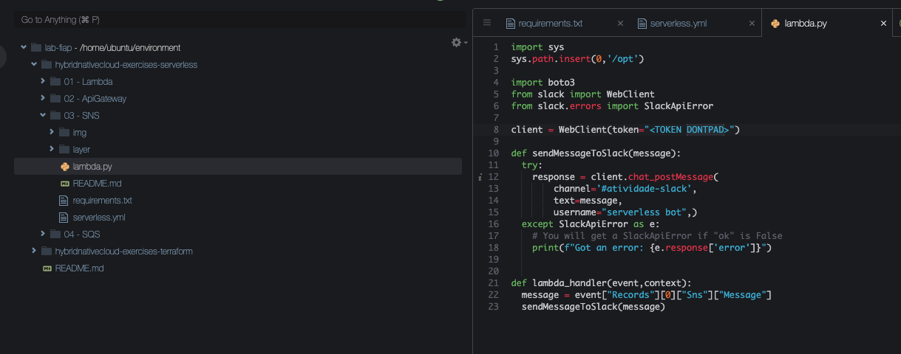

# Aula 05.3 - Lambda

1. No terminal do IDE criado no cloud9 execute o comando `cd ~/environment/hybridnativecloud-exercises-serverless/03\ -\ SNS/` para entrar na pasta que fara este exercicio.
2. Utilize virtualenv para esse exercicio com os comandos:
   ``` shell
      python3 -m venv ~/venv 
      source ~/venv/bin/activate
   ```
3. Crie uma pasta chamada layer com o comando `mkdir layer` no terminal
4. Execute o comando `pip3 install -r requirements.txt -t layer/` para que todas as dependecias fiquem dentro desta pasta.
5. Vamos criar o SNS que será utilizado no exercicio, para isso abra uma aba do console e vá para o serviço SNS. No menu lateral do serviço clique em Tópicos.
   
6. No canto superior direito clique em Criar tópico
7. Preencha o nome do tópico e clique em Criar Tópico 
   
8. O ARN que será utlizado no código esta na pagina do Tópico que criou
   
9.  Crie um arquivo 'serverless.yml' com o seguinte conteudo

10. Crie um arquivo 'lambda.py' com o seguinte conteudo
    
11.  No conteudo de Webclient Token copie e cole o token do dontpad
12. No channel coloque o seguinte `#atividade-slack`
13. Execute o comando `sls deploy`
14. Agora cada vez que você publicar uma mensagem para o SNS irá receber uma mensagem no slack
15. Para enviar uma mensagem vá até o console SNS do seu tópico e cliquem em `Publicar mensagem` no canto superior direito da tela.
16. Preencha o corpo da mensagem com o conteudo desejado e clique em `Publicar mensagem`
    
17. Sua mensagem aparecerá no Slack

