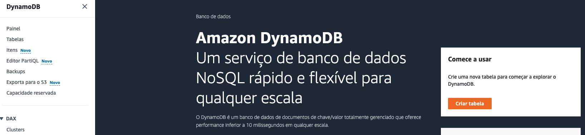
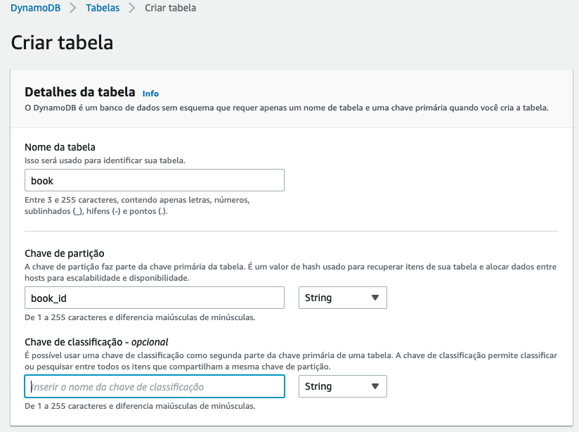
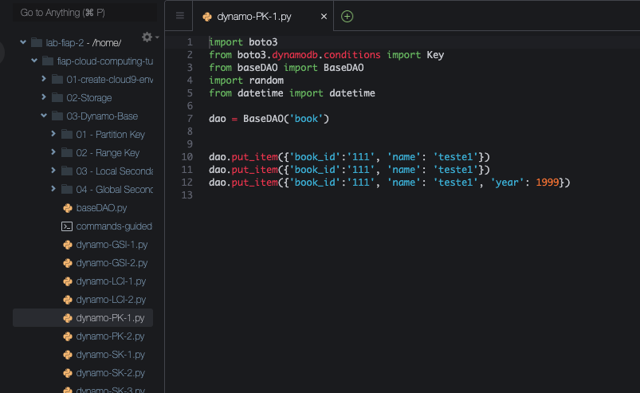
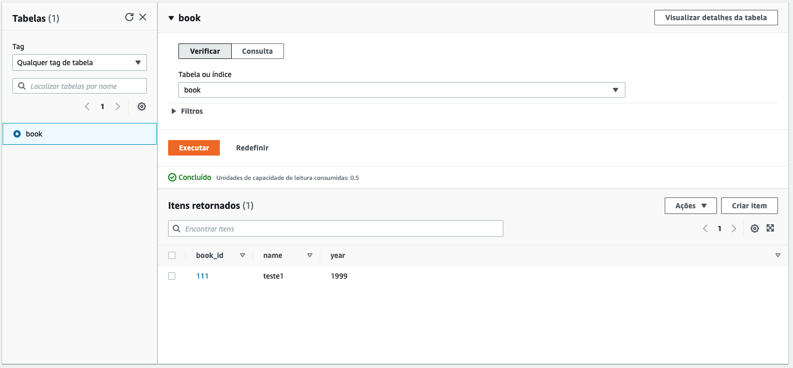
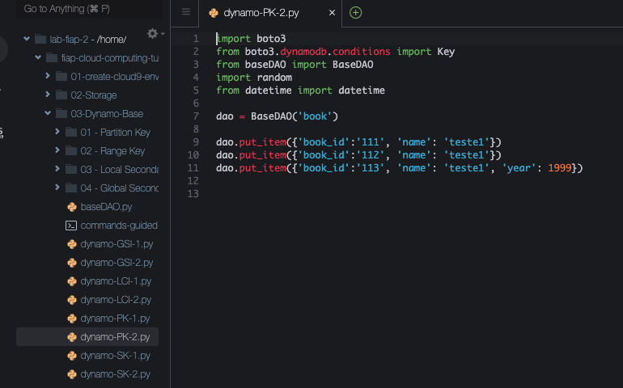
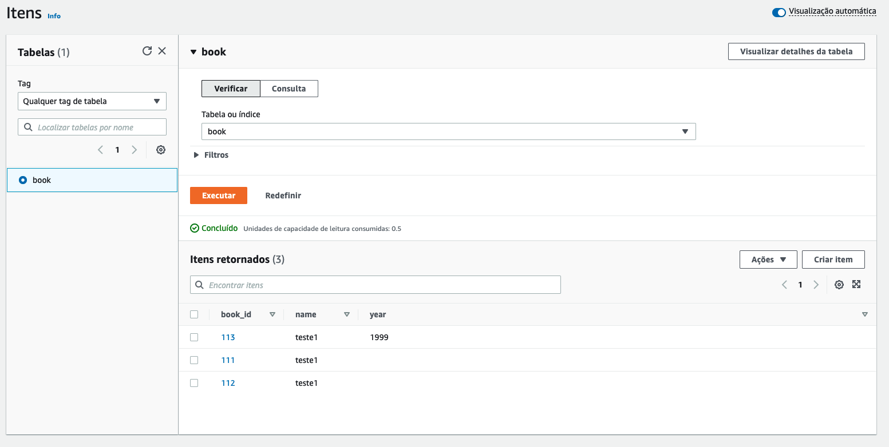

# 03.1 - Partition key

1. No console do dynamoDB clique em `Criar Tabela`.

1. Preencha os dados como na imagem e clique em `Criar tabela` no final da página.

3. A tabela pode levar alguns minutos para ser criada. Aguarde.
4. De volta ao cloud9 acesse a pasta com os scripts a serem utilizados: `cd ~/environment/fiap-serverless-architecture-tutorials/03-Dynamo`
5. Abra o arquivo dynamo-PK-1.py utilizando o comando `c9 open dynamo-PK-1.py`

5. Utilizando esse script você vai inserir 3 Items com o mesma PK na tabela. Execute o comando `python3 dynamo-PK-1.py`
6. De volta ao painel do dynamoDB clique na tabela `book` e clique em `Visualizar Items` no canto superior direito.
7. Verá que temos apenas um registro. Isso ocorreu porque quando inserirmos partition keys identicas o banco sobrescreve o registro anterior.

7. Abra o arquivo dynamo-PK-2.py utilizando o comando `c9 open dynamo-PK-2.py`

8. Esse script também vai inserir 3 itens na tabela, porém com PKs diferentes. `python3 dynamo-PK-2.py`
9. Agora a tabela book tem 3 registros, cada um com seu atributo. Para atualizar, clique em `Executar`

### Documentação
[https://aws.amazon.com/pt/blogs/database/choosing-the-right-dynamodb-partition-key/](https://aws.amazon.com/pt/blogs/database/choosing-the-right-dynamodb-partition-key/)