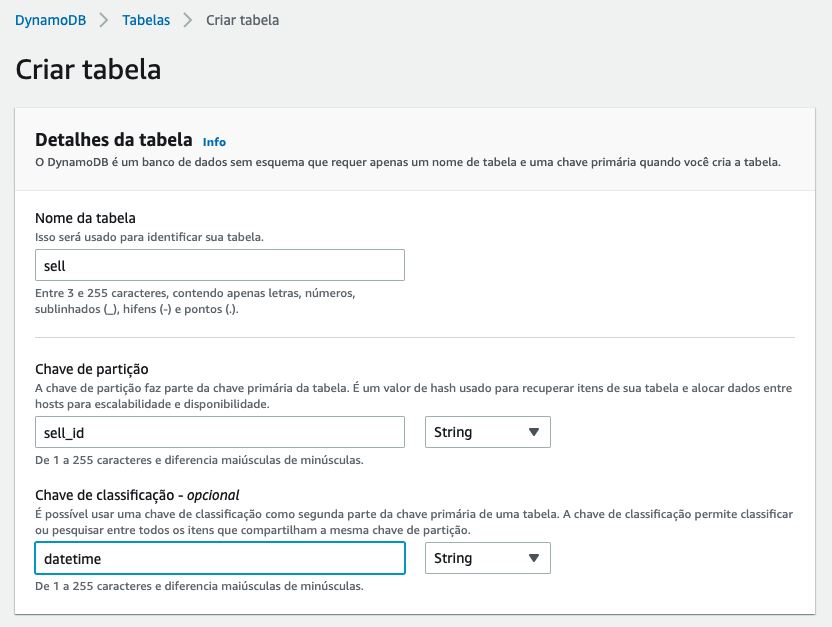
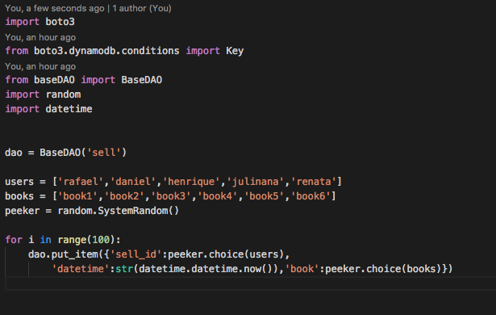
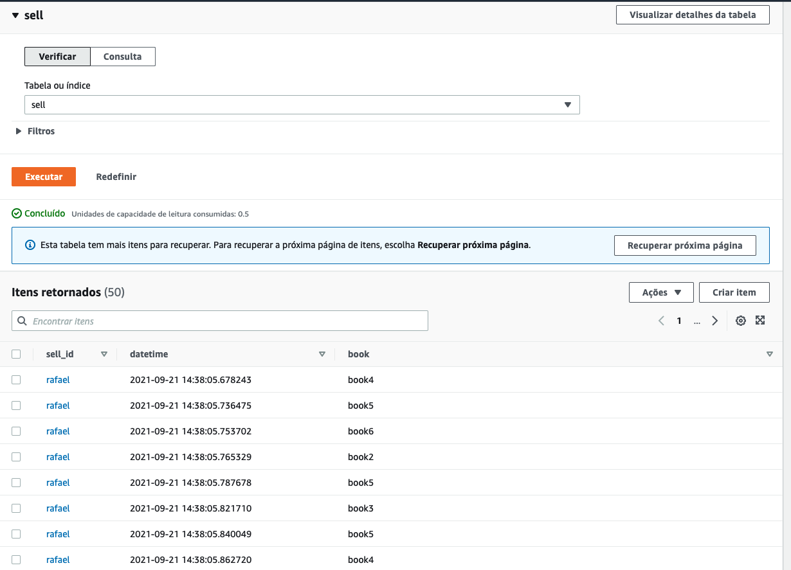
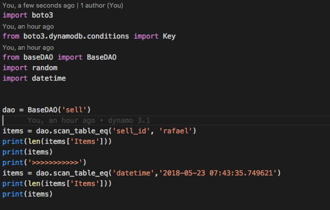
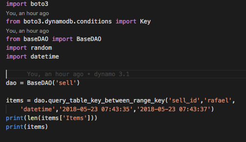

# 03.2 - Range Key

1. Clique em 'Create Table'
2. Preencha os dados como na imagem e clique em 'Create'

3. De volta ao cloud9 acesse a pasta com os scripts a serem utilizados: `cd ~/environment/fiap-serverless-architecture-tutorials/03-Dynamo-Base`
4. Abra o arquivo dynamo-SK-1.py no IDE com o comando `c9 open dynamo-SK-1.py`

4. Esse script irá popular de maneira randomica combinações dos objetos das listas users e books. Execute o comando `python3 dynamo-SK-1.py`
5. Agora sua tabela estará populada com 100 objetos

6. Abra o arquivo dynamo-SK-2.py no IDE com o comando `c9 open dynamo-SK-2.py`
7. Escolha um dos datetimes e um dos nomes que constam na sua tabela sell e altere novamente o arquivo 'dynamo-SK-2' para que fique como na imagem. Copie de valores da sua tabela, caso contrario não retornará nenhum valor. Não esqueça de salvar com ctrl+s

7. Execute o arquivo com `python3 dynamo-SK-2.py`
8. Abra o arquivo dynamo-SK-3.py no IDE com o comando `c9 open dynamo-SK-3.py`
9. Escolha um intervalo de tempo em sua tabela e deixe seu arquivo 'dynamo-SK-3.py' como na imagem. Ao visualizar os dados na tabela do dynamo ordene por data para facilitar copiar 2 datas crescentes.

1.  Execute o arquivo com `python3 dynamo-SK-3.py`
2.  Abra o arquivo dynamo-SK-4.py no IDE com o comando `c9 open dynamo-SK-4.py`
3.  Escolha um nome e um intervalo de tempo que tenha registros e altere o arquivo 'dynamo-SK-4.py' como na imagem

1.  Execute o arquivo com `python3 dynamo-SK-4.py`
2.  No painel do dynamoDB vá até a aba 'Items' e execute uma query como a que fez utilizando python, porem adicionando book como filtro

### Documentação
[https://docs.aws.amazon.com/amazondynamodb/latest/APIReference/API_Query.html](https://docs.aws.amazon.com/amazondynamodb/latest/APIReference/API_Query.html)