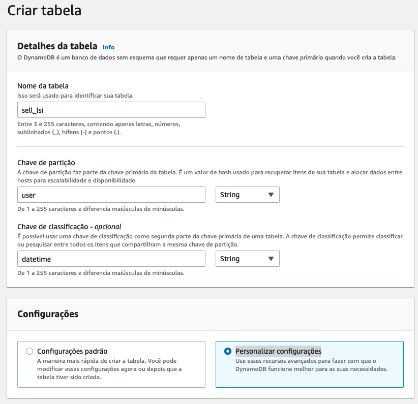
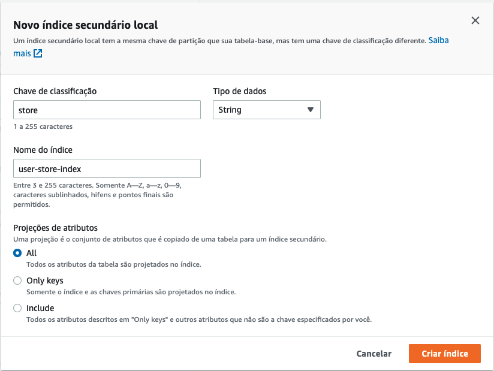
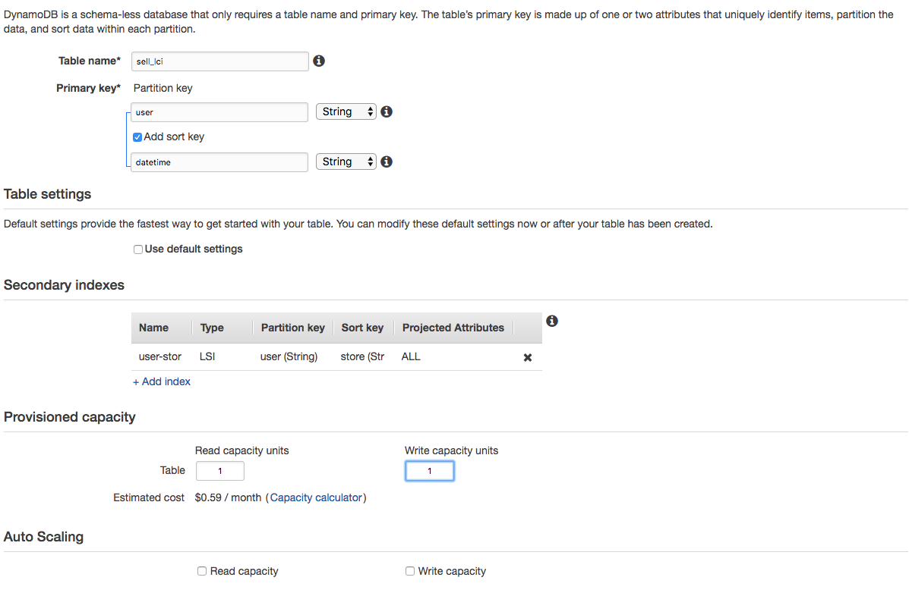
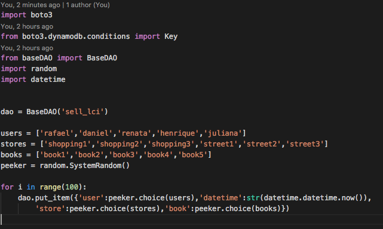
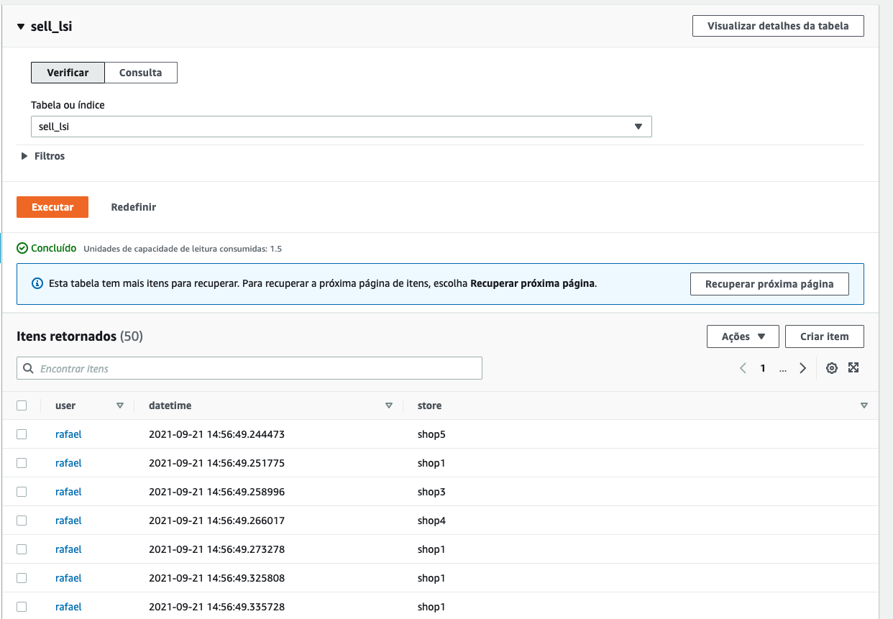
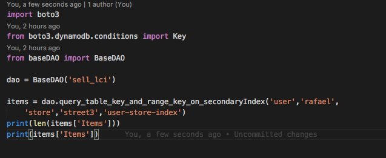

# 03.3 - Local Secondary Key

1. Clique um 'Create table' e preencha o formulário como na imagem, após clique em '+ Add Index'

2. Preencha o Index com as seguintes informações e clique em 'Add Index'

3. Desmarque as opções de Auto Scalling e deixe o 'Provisioned capacity' como na imagem, e clique em 'Create'

4. De volta ao cloud9 acesse a pasta com os scripts a serem utilizados: `cd ~/environment/fiap-serverless-architecture-tutorials/03-Dynamo-Base`
5. Abra o arquivo dynamo-SK-1.py no IDE com o comando `c9 open dynamo-LCI-1.py`
 
6. Esse script irá popular de maneira randomica combinações dos objetos das listas users, stores e books.Execute o arquivo com `python3 dynamo-LCI-1.py`

7. Abra o arquivo dynamo-SK-2.py no IDE com o comando `c9 open dynamo-LCI-2.py`
8. Escolha um usuario e um range de um segundo para executar o arquivo 'dynamo-LCI-2.py' como no exemplo.

9. Note que o script esta fazendo uma query no indice 'user-store-index' criado na tabela anteriormente.Execute o comando `python3 dynamo-LCI-2.py`

### Docuemntação
[https://docs.aws.amazon.com/amazondynamodb/latest/developerguide/LSI.html](https://docs.aws.amazon.com/amazondynamodb/latest/developerguide/LSI.html)