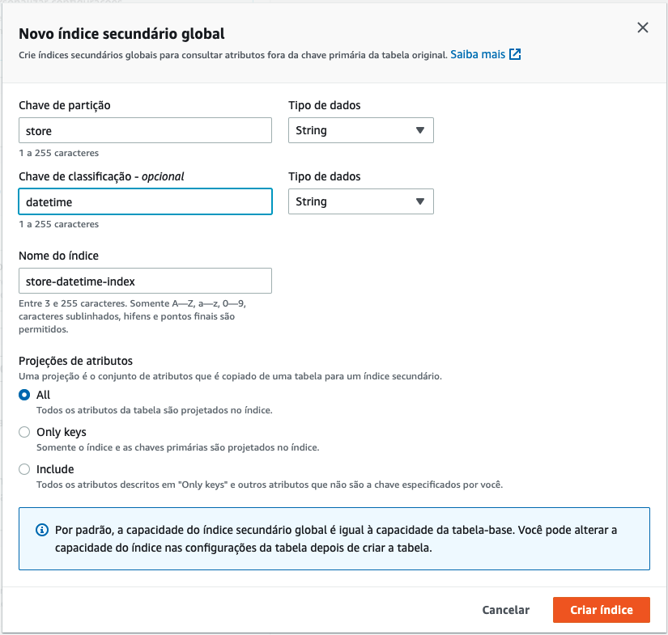
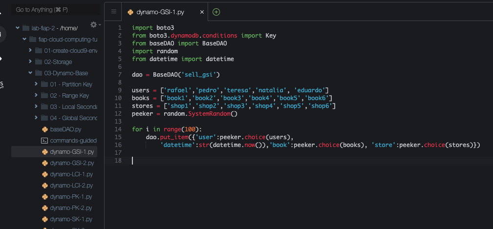
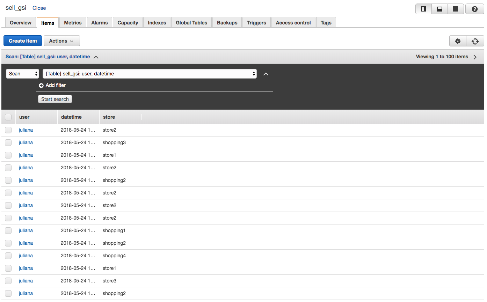
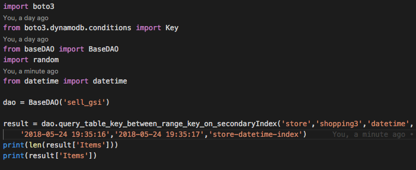

# 03.4 - Global Secondary Key

1. Crie uma table chamada 'sell_gsi' utilizando 'user' como PK e 'datetime' como SK.
2. Nessa tabela vá até a aba 'Indexes', e clique em 'Create Index'.

3. Preencha como a imagem, e clique em 'Create Index'. Esse processo pode demorar.

4. De volta ao cloud9 acesse a pasta com os scripts a serem utilizados: `cd ~/environment/fiap-serverless-architecture-tutorials/03-Dynamo-Base`
5. Abra o arquivo dynamo-GSI-1.py no IDE com o comando `c9 open dynamo-GSI-1.py`

6. Esse script irá popular de maneira randomica combinações dos objetos das listas users,stores e books. Execute o arquivo com o comando `python3 dynamo-GSI-1.py`

7. Abra o arquivo dynamo-GSI-2.py no IDE com o comando `c9 open dynamo-GSI-2.py`
8. Altere o arquivo 'dynamo-GSI-2.py' para que fique como na imagem, escolhendo um invervalo valido de um segundo para o usuario pesquisado

9. O script vai pesquisar na global secondary key 'store-datetime-index' criada os dados. Execute o arquivo com o comando `python3 dynamo-GSI-2.py`
    

### Documentação
[https://docs.aws.amazon.com/amazondynamodb/latest/developerguide/GSI.html](https://docs.aws.amazon.com/amazondynamodb/latest/developerguide/GSI.html)
