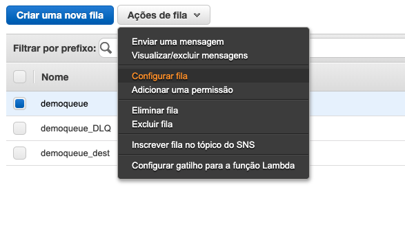

# Aula 04.2 - DLQ Queue

1. No terminal do IDE criado no cloud9 execute o comando `cd ~/environment/hybridnativecloud-exercises-serverless/04\ -\ SQS/02\ -\ DLQ/` para entrar na pasta que fara este exercicio.
2. Na aba do SQS crie uma fila com o mesmo nome de uma fila já criada e coloque o sulfixo '_DLQ'
3. Selecione a fila Demoqueue clique em 'Ações  fila' e depois em 'Configurar fila'

3. Preencha as informações como na imagem, e clique me 'Salvar alterações'

1. Altere o arquivo put.py colocando a URL da fila demoqueue nele.
2. execute o comando `python3 put.py` no terminal
3. Faça as alterações no arquivo consumer.py conforme a imagem a baixo, não esquecendo de colcoar suaa URL da demoqueue:

9. Execute o comando `python3 consumer.py` no terminal
10. Observe que enquanto roda o script a fila DLQ é populada no console do SQS
    