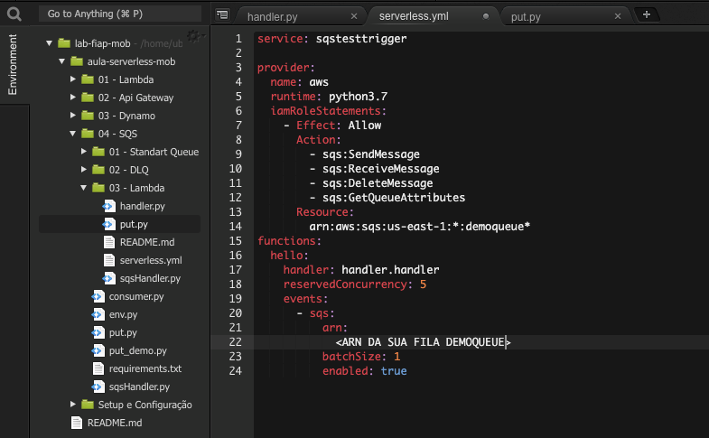

# Aula 04.3 - Lambda

1. No terminal do IDE criado no cloud9 execute o comando `cd ~/environment/hybridnativecloud-exercises-serverless/04\ -\ SQS/03\ -\ Lambda` para entrar na pasta que fara este exercicio.
2. Execute o comando `sls create --template "aws-python3"` no terminal para criar os arquivos do serverless framework.
3. Altere o handler.py para ficar como na imagem. Não esqueça de colocar a URL da sua fila de destino.
   
4. Altere o serverless.yml para que fique como na imagem.
   
5. Vá a sua aba do SQS e configure sua demoqueue para ficar como na imagem, isso é necessário pois o tempo de visibilidade padrão estava em 1 segundo para forçar erros no teste da DLQ do ultimo exercicio:
   
6. Execute o comando `sls deploy` no terminal
7. Altere o arquivo put.py colocando a URL da sua fila demoqueue.
8. Execute o comando `python3 put.py` no terminal e observe no painel do sqs que as msgs estão indo para a fila de destino.
   
9. Para excluir a stack do lambda execute o comando `sls remove` no terminal