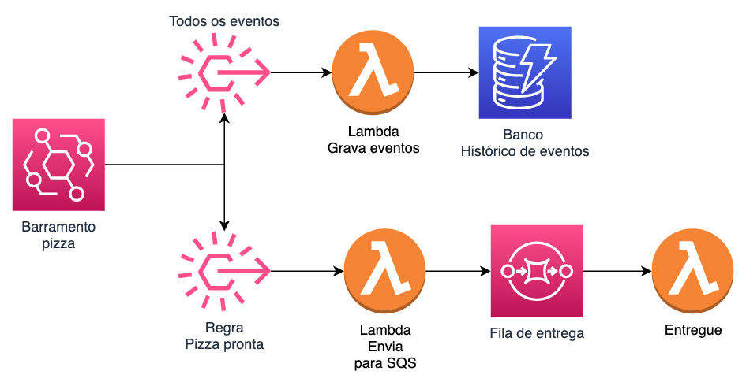

# Trabalho Final




Nessa arquitetura um barramento do eventBridge vai receber todos os eventos de uma pizzaria. Desde o pedido até a entrega. Onde cada um dos eventos deve ser guardados no banco de dados dynamo e apenas os eventos de pizza pronta que devem ser adicionados a fila SQS que posteriormente deve ser consumida por outro lambda.


### Passos

1. Crie manualmente um novo barramento de eventos no eventBridge, o banco de dados DynamoDB e a fila SQS.
   1. EventBridge:
      1. Nome = pizzaria
   2. DynamoDB:
      1. Chave de partição: pedido(String)
      2. Chave de pesquisa: status(String)
      3. Nome: eventos-pizzaria
   3. Fila SQS:
      1. Tipo: Standard
      2. Nome: espera-entrega
2. Crie via Serverless Framework os lambdas e regras no barramento de eventos do passo anterior, cada um executando sua respectiva função conforme descrito na arquitetura.
3. Crie o lambda que receberá as mensagens vindas da fila eventos-pizzaria em batch de 1 mensagem cada.
4. A entrega consiste em todos os arquivos de programação e configuração gerados para provisionar os lambdas e regras do eventBridge. Faça um zip dos mesmos e submeta no portal fiap. Caso o código esteja no git é só fazer o download do zip direto no github.


### Informações e dicas

1. Pode escolher qualquer linguagem suportada pelo lambad para resolver o exercicio. Todos os exemplos estão em python3
2. Para testar o seu exercicio esta disponibilizado nesta pasta um arquivo chamado putEventsPizzaria.py que irá inserir eventos de todos os tipos para o barramento escolhido.
3. Exemplo de json do evento do eventBridge:
   ``` json
   {
    "version": "0",
    "id": "6e6b1f6d-48f8-5dff-c2d2-a6f22c2e0086",
    "detail-type": "Alteracao Pizza",
    "source": "com.pizza.status",
    "account": "529761443475",
    "time": "2021-09-23T15:35:41Z",
    "region": "us-east-1",
    "resources": [],
    "detail": {
        "status": "no forno",
        "pedido": "1234",
        "cliente": "rafael"
        }
    }
   ```
4. Exemplo de item a ser inserido no DynamoDB:
   ``` json
   {
      "pedido": "1234",
      "status": "no forno",
      "cliente": "rafael",
      "time": "2021-09-23T15:35:41Z"
   }
   ```
5. Os códigos para inserir um item no DynamoDB e no SQS estão disponiveis no tutorial de cada tema.